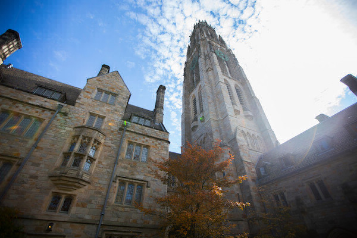
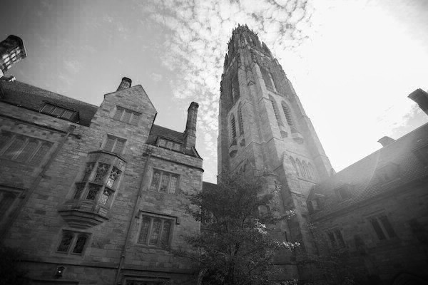

# Image-filters

The program applies different filters to BMP images, including grayscale, reflection, blur, and edge detection.

Files
helpers.c - contains the filter functions
helpers.h - function declarations
filter.c - main program
Makefile - used to compile the program
How to run

Compile the program:
make filter
Then run it with:

./filter -g input.bmp output.bmp

Replace -g with the filter you want to use.

## Input Image:

## Output Images:

.bmp)
.bmp)
.bmp)
